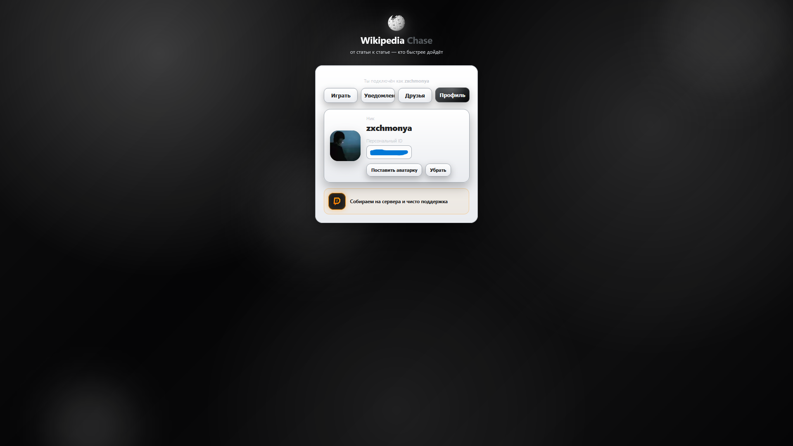

# Pinterest Chase

Pinterest Chase - это LAN-игра для друзей, где все соревнуются, кто быстрее найдет путь от одной темы к другой. В начале раунда игра выдает стартовое слово и цель. Дальше игроки открывают Pinterest или Wikipedia и пытаются как можно быстрее добраться до нужного результата. Кто нашел цель первым, нажимает "Я нашел" и занимает первое место.

Играть можно по локальной сети или через Radmin VPN. Один игрок запускает сервер и создает лобби, остальные подключаются по IP хоста. Игра рассчитана именно на компанию друзей: быстро зашел, создал комнату, позвал остальных и начал раунд.

## Скриншоты

### Главное меню


### Лобби


### Профиль



### Раунд


## Как играть

1. Хост запускает `server.py`.
2. Хост открывает игру в браузере:

```txt
http://localhost:8787
```

3. Другие игроки подключаются по IP хоста из Radmin VPN:

```txt
http://АЙПИ_ХОСТА_ИЗ_RADMIN_VPN:8787
```

4. Каждый вводит свой ник.
5. Хост создает лобби и зовет друзей.
6. Все заходят в лобби.
7. Хост выбирает режим и запускает раунд.
8. Игра показывает стартовую тему и цель.
9. Игроки ищут цель.
10. Кто нашел, нажимает "Я нашел".
11. Если игрок не хочет продолжать раунд, он может нажать "Сдаться".

Если все игроки сдались, победителя нет - раунд считается проигранным.

## Режимы игры

- **Pinterest** - легкий режим. Нужно искать цель через Pinterest.
- **Wikipedia** - сложный режим. Нужно переходить по статьям Wikipedia и добраться до цели.

## Что есть в игре

- Лобби для игры с друзьями по LAN.
- Подключение через Radmin VPN.
- Два режима: Pinterest и Wikipedia.
- Система друзей.
- Приглашения в лобби.
- Уведомления.
- Профиль игрока с ником, аватаркой и персональным ID.
- История матчей.
- Таймер раунда.
- Таблица мест.
- Кнопка "Сдаться".
- Звуки кнопок, мест, победы и поражения.
- Конфетти при победе.
- Донат-кнопка для поддержки проекта.

## Важно

Игру лучше открывать через серверный адрес `http://...`, а не напрямую через `index.html`, потому что браузер может блокировать звуки, картинки и встроенную Wikipedia при запуске из файла.

## О проекте

Проект сделан как фан-игра для компании друзей. Здесь нет сложной регистрации, онлайн-серверов и лишней серьезности. Просто запускаешь сервер, зовешь друзей и соревнуешься, кто быстрее найдет нужную тему.
